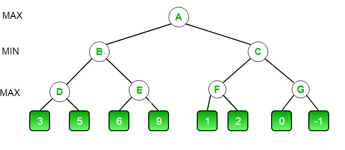
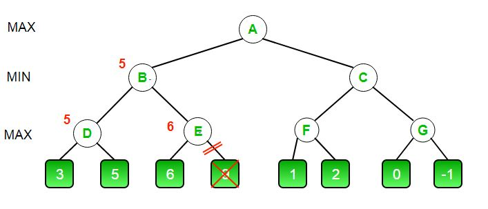
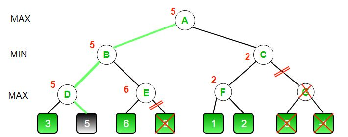

# Alpha-Beta Pruning
Alpha-Beta pruning is not actually a new algorithm, rather an optimization technique for minimax algorithm. It reduces the computation time by a huge factor. This allows us to search much faster and even go into deeper levels in the game tree. It cuts off branches in the game tree which need not be searched because there already exists a better move available. It is called Alpha-Beta pruning because it passes 2 extra parameters in the minimax function, namely alpha and beta.

Let’s define the parameters alpha and beta.
Alpha is the best value that the maximizer currently can guarantee at that level or above.
Beta is the best value that the minimizer currently can guarantee at that level or above.

## Pseudocode :

function minimax(node, depth, isMaximizingPlayer, alpha, beta):

    if node is a leaf node :
        return value of the node
    
    if isMaximizingPlayer :
        bestVal = -INFINITY 
        for each child node :
            value = minimax(node, depth+1, false, alpha, beta)
            bestVal = max( bestVal, value) 
            alpha = max( alpha, bestVal)
            if beta <= alpha:
                break
        return bestVal

    else :
        bestVal = +INFINITY 
        for each child node :
            value = minimax(node, depth+1, true, alpha, beta)
            bestVal = min( bestVal, value) 
            beta = min( beta, bestVal)
            if beta <= alpha:
                break
        return bestVal

// Calling the function for the first time.
minimax(0, 0, true, -INFINITY, +INFINITY)

Let’s make above algorithm clear with an example.

    The initial call starts from A. The value of alpha here is -INFINITY and the value of beta is +INFINITY. These values are passed down to subsequent nodes in the tree. At A the maximizer must choose max of B and C, so A calls B first
    At B it the minimizer must choose min of D and E and hence calls D first.
    At D, it looks at its left child which is a leaf node. This node returns a value of 3. Now the value of alpha at D is max( -INF, 3) which is 3.
    To decide whether its worth looking at its right node or not, it checks the condition beta<=alpha. This is false since beta = +INF and alpha = 3. So it continues the search.
    D now looks at its right child which returns a value of 5.At D, alpha = max(3, 5) which is 5. Now the value of node D is 5
    D returns a value of 5 to B. At B, beta = min( +INF, 5) which is 5. The minimizer is now guaranteed a value of 5 or lesser. B now calls E to see if he can get a lower value than 5.
    At E the values of alpha and beta is not -INF and +INF but instead -INF and 5 respectively, because the value of beta was changed at B and that is what B passed down to E
    Now E looks at its left child which is 6. At E, alpha = max(-INF, 6) which is 6. Here the condition becomes true. beta is 5 and alpha is 6. So beta<=alpha is true. Hence it breaks and E returns 6 to B
    Note how it did not matter what the value of E‘s right child is. It could have been +INF or -INF, it still wouldn’t matter, We never even had to look at it because the minimizer was guaranteed a value of 5 or lesser. So as soon as the maximizer saw the 6 he knew the minimizer would never come this way because he can get a 5 on the left side of B. This way we dint have to look at that 9 and hence saved computation time.
    E returns a value of 6 to B. At B, beta = min( 5, 6) which is 5.The value of node B is also 5

So far this is how our game tree looks. The 9 is crossed out because it was never computed.

    B returns 5 to A. At A, alpha = max( -INF, 5) which is 5. Now the maximizer is guaranteed a value of 5 or greater. A now calls C to see if it can get a higher value than 5.
    At C, alpha = 5 and beta = +INF. C calls F
    At F, alpha = 5 and beta = +INF. F looks at its left child which is a 1. alpha = max( 5, 1) which is still 5.
    F looks at its right child which is a 2. Hence the best value of this node is 2. Alpha still remains 5
    F returns a value of 2 to C. At C, beta = min( +INF, 2). The condition beta <= alpha becomes true as beta = 2 and alpha = 5. So it breaks and it does not even have to compute the entire sub-tree of G.
    The intuition behind this break off is that, at C the minimizer was guaranteed a value of 2 or lesser. But the maximizer was already guaranteed a value of 5 if he choose B. So why would the maximizer ever choose C and get a value less than 2 ? Again you can see that it did not matter what those last 2 values were. We also saved a lot of computation by skipping a whole sub tree.
    C now returns a value of 2 to A. Therefore the best value at A is max( 5, 2) which is a 5.
    Hence the optimal value that the maximizer can get is 5

This is how our final game tree looks like. As you can see G has been crossed out as it was never computed.

