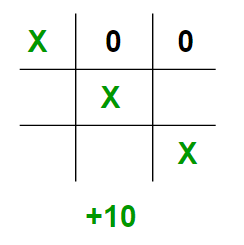
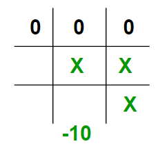
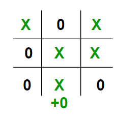

# Introduction to Evaluation Function
In the real world when we are creating a program to play Tic-Tac-Toe, Chess, Backgamon, etc. we need to implement a function that calculates the value of the board depending on the placement of pieces on the board. This function is often known as Evaluation Function. It is sometimes also called Heuristic Function.

The evaluation function is unique for every type of game. In this post, evaluation function for the game Tic-Tac-Toe is discussed. The basic idea behind the evaluation function is to give a high value for a board if maximizer‘s turn or a low value for the board if minimizer‘s turn.

For this scenario let us consider X as the maximizer and O as the minimizer.

Let us build our evaluation function :

 If X wins on the board we give it a positive value of +10.
    
   
   
 If O wins on the board we give it a negative value of -10.
 
  
  
 If no one has won or the game results in a draw then we give a value of +0.
 
   
   
   We could have chosen any positive / negative value other than 10. For the sake of simplicity we chose 10 for the sake of simplicity we shall use lower case ‘x’ and lower case ‘o’ to represent the players and an underscore ‘_’ to represent a blank space on the board.

If we represent our board as a 3×3 2D character matrix, like char board[3][3]; then we have to check each row, each column and the diagonals to check if either of the players have gotten 3 in a row.
