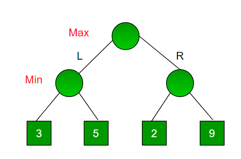
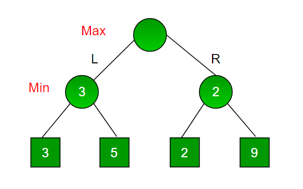

# Introduction
Minimax is a kind of backtracking algorithm that is used in decision making and game theory to find the optimal move for a player, assuming that your opponent also plays optimally. It is widely used in two player turn-based games such as Tic-Tac-Toe, Backgammon, Mancala, Chess, etc.

In Minimax the two players are called maximizer and minimizer. The maximizer tries to get the highest score possible while the minimizer tries to do the opposite and get the lowest score possible.

Every board state has a value associated with it. In a given state if the maximizer has upper hand then, the score of the board will tend to be some positive value. If the minimizer has the upper hand in that board state then it will tend to be some negative value. The values of the board are calculated by some heuristics which are unique for every type of game.

## Example:
Consider a game which has 4 final states and paths to reach final state are from root to 4 leaves of a perfect binary tree as shown below. Assume you are the maximizing player and you get the first chance to move, i.e., you are at the root and your opponent at next level. Which move you would make as a maximizing player considering that your opponent also plays optimally?

Since this is a backtracking based algorithm, it tries all possible moves, then backtracks and makes a decision.

    Maximizer goes LEFT: It is now the minimizers turn. The minimizer now has a choice between 3 and 5. Being the minimizer it will definitely choose the least among both, that is 3
    Maximizer goes RIGHT: It is now the minimizers turn. The minimizer now has a choice between 2 and 9. He will choose 2 as it is the least among the two values.

Being the maximizer you would choose the larger value that is 3. Hence the optimal move for the maximizer is to go LEFT and the optimal value is 3.

Now the game tree looks like below :

The above tree shows two possible scores when maximizer makes left and right moves.

Note: Even though there is a value of 9 on the right subtree, the minimizer will never pick that. We must always assume that our opponent plays optimally.

The idea of this article is to introduce Minimax with a simple example.

    In the above example, there are only two choices for a player. In general, there can be more choices. In that case, we need to recur for all possible moves and find the maximum/minimum. For example, in Tic-Tax-Toe, the first player can make 9 possible moves.
    In the above example, the scores (leaves of Game Tree) are given to us. For a typical game, we need to derive these values
